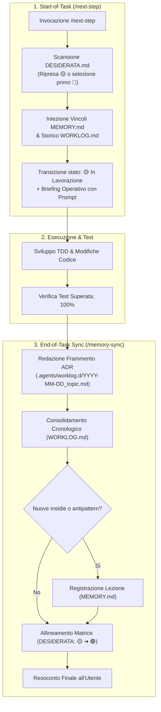

# Antigravity Plugin: Cognitive Persistence & Project Memory

Plugin per Google Antigravity progettato per garantire la **continuità cognitiva e la persistenza della memoria architetturale** tra sessioni di lavoro indipendenti e riavvii di contesto.

---

## Obiettivo del Plugin (Goal)

Nei flussi di sviluppo assistiti da agenti AI, la perdita di contesto tra una sessione e l'altra (amnesia di contesto) comporta tre criticità ricorrenti:
1. **Regressioni concettuali**: l'agente reintroduce bug già risolti in precedenza o ricade in incompatibilità note dell'ambiente.
2. **Perdita di Architectural Decision Records (ADR)**: le motivazioni tecniche dietro scelte strutturali complesse non vengono formalizzate e vanno perdute.
3. **Disallineamento sullo stato del progetto**: assenza di una visione chiara e sintetica su quali feature siano realmente implementate, quali parziali e quali ancora pianificate.

Il plugin `cognitive-persistence` risolve questo problema introducendo la **Triade Cognitiva di Progetto** e una **direttiva obbligatoria di sincronizzazione a fine task (End-of-Task Sync)**.

---

## Architettura: La Triade Cognitiva

Il plugin governa tre file standard posizionati alla radice del repository di destinazione:

```
<radice-progetto>/
├── MEMORY.md                 # Vincoli stabili, lezioni apprese, antipattern banditi
├── WORKLOG.md                # Giornale mastro cronologico degli interventi e decisioni architetturali
├── DESIDERATA.md             # Matrice dello stato di avanzamento delle funzionalità
└── .agents/
    └── worklog.d/            # Frammenti ADR granulari (YYYY-MM-DD_<argomento>.md)
```

### 1. `MEMORY.md` (Vincoli Stabili & Lezioni Apprese)
Registra la conoscenza empirica non ovvia acquisita durante lo sviluppo. Ogni voce viene strutturata secondo uno schema causale rigido:
- **Problema riscontrato**: sintomo o malfunzionamento rilevato.
- **Causa radice**: spiegazione tecnica dettagliata (es. race condition, peculiarità del runtime Node/DOM, incompatibilità fra librerie).
- **Pattern preventivo vincolante**: regola architetturale o vincolo da seguire tassativamente in ogni sessione futura.

### 2. `WORKLOG.md` & Frammenti Granulari (`.agents/worklog.d/`)
Per evitare conflitti di merge e consentire tracciabilità atomica:
- L'agente genera dapprima una scheda di dettaglio in `.agents/worklog.d/YYYY-MM-DD_<argomento>.md` contenente contesto, motivazione, decisioni architetturali e impatti.
- I frammenti vengono successivamente consolidati nel documento unificato `WORKLOG.md`.

### 3. `DESIDERATA.md` (Matrice di Stato Funzionale)
Mappa l'intero ciclo di vita delle funzionalità tramite uno schema tabellare con indicatori di stato espliciti:
- `🔴 Pianificato`: requisito architetturale o funzionale non ancora avviato.
- `🟡 In Lavorazione`: modulo con implementazione parziale o in fase di test.
- `🟢 Completato`: funzionalità implementata, verificata da test e documentata.

---

## Componenti del Plugin

| Componente | Tipo | Percorso | Funzione |
| :--- | :--- | :--- | :--- |
| **Regola di Condotta** | Regola attiva | [`rules/AGENTS.md`](./rules/AGENTS.md) | Impone all'agente l'obbligo di consultare la triade cognitiva all'avvio del task e di sincronizzarla al completamento prima di rilasciare il controllo. |
| **`next-step`** | Skill / Comando Slash | [`skills/next-step/SKILL.md`](./skills/next-step/SKILL.md) | Runbook di accoglienza requisiti invocabile con `/next-step`: scansiona `DESIDERATA.md`, recupera vincoli da `MEMORY.md`, commuta lo stato in `🟡 In Lavorazione` e produce il briefing operativo con prompt deterministico. |
| **`memory-sync`** | Skill on-demand | [`skills/memory-sync/SKILL.md`](./skills/memory-sync/SKILL.md) | Runbook operativo che guida l'agente nei 5 passaggi di redazione frammento, consolidamento giornale, aggiornamento lezioni e allineamento matrice a fine task. |

---

## Ciclo Operativo Integrato: Avvio e Sincronizzazione di Fine Task

Il plugin orchestra l'intero ciclo di vita dello sviluppo legando l'avvio alla chiusura:



---

## Prompt di Esempio

- *"`/next-step`"* (o *"Cerca il prossimo desiderata pianificato e avvia la lavorazione."*)
- *"`/next-step --auto`"* (seleziona il task prioritario e procede immediatamente all'analisi e ai test)
- *"Esegui la sincronizzazione della memoria di progetto per l'intervento appena completato."*
- *"Registra in MEMORY.md la causa radice del bug di rendering appena risolto e il pattern per evitarlo."*
- *"Allinea lo stato di DESIDERATA.md con le funzionalità rilasciate e prepara la scheda ADR."*

---

## Modalità di Installazione

### 1. Installazione nel Singolo Workspace (Consigliata)
Copiare la cartella in `.agents/plugins/` del repository:

```bash
# Linux/macOS
mkdir -p <percorso-progetto>/.agents/plugins
cp -r plugins/cognitive-persistence <percorso-progetto>/.agents/plugins/

# Windows (PowerShell)
New-Item -ItemType Directory -Force -Path "<percorso-progetto>\.agents\plugins"
Copy-Item -Recurse plugins/cognitive-persistence "<percorso-progetto>\.agents\plugins\"
```

In alternativa su Windows, creare una **Directory Junction** per mantenere il plugin collegato al repository sorgente:
```powershell
New-Item -ItemType Junction -Path "<percorso-progetto>\.agents\plugins\cognitive-persistence" -Target "c:\github\antigravity-plugins\plugins\cognitive-persistence"
```

### 2. Installazione Globale (Per tutti i progetti)
```powershell
Copy-Item -Recurse plugins/cognitive-persistence "$env:USERPROFILE\.gemini\config\plugins\"
```

---

## Sinergia con gli Altri Plugin

- **`engineering-workflow`**: durante l'uso di Git Worktree, il frammento in `worklog.d/` viene scritto nel worktree e consolidato prima del merge su `main`.
- **`execution-guard`**: quando un loop o uno stallo viene interrotto dal circuit breaker, la causa radice dell'invarianza viene trascritta in `MEMORY.md` per impedire iterazioni analoghe nelle sessioni successive.
