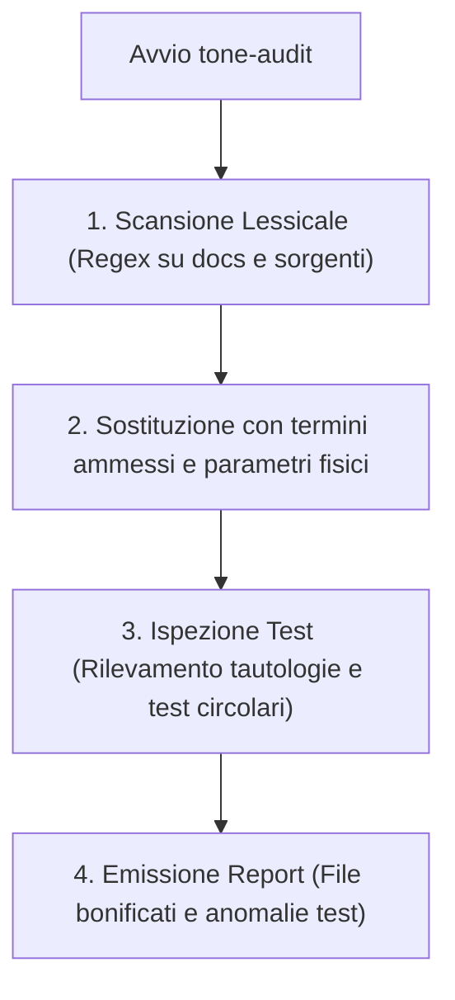

# Antigravity Plugin: Engineering Sobriety & Anti-Sycophancy

Plugin per Google Antigravity progettato per imporre **rigore tecnico, sobrietà espressiva e integrità ingegneristica**, eliminando il linguaggio promozionale, i convenevoli superflui e l'adulazione passiva (anti-sycophancy).

---

## Obiettivo del Plugin (Goal)

Nelle interazioni tra sviluppatore e modelli linguistici generativi si riscontrano frequentemente tre deviazioni dannose per la qualità del software:
1. **Compiacimento e convenevoli vuoti (Sycophancy)**: preamboli enfatici ("Ottima idea!", "Certamente!", "Perfetto!") che consumano token e ritardano la diagnosi tecnica.
2. **Gergo enfatico e fuffa promozionale (Hype)**: aggettivi privi di riscontro empirico (`rivoluzionario`, `bulletproof`, `stato dell'arte`) o metafore pseudo-militari applicate a componenti software ordinari (`cockpit`, `scansione tattica`).
3. **Faux-Testing e Placebo UI**: test unitari tautologici (in cui l'output atteso deriva dalla stessa formula del codice sotto esame) o mockup fittizi spacciati per benchmark empirici.

Il plugin `engineering-sobriety` stabilisce un vincolo operazionale permanente: comunicazioni asciutte ancorate a parametri misurabili, trasparenza immediata sui limiti e divieto assoluto di test auto-convalidanti.

---

## Componenti del Plugin

| Componente | Tipo | Percorso | Funzione |
| :--- | :--- | :--- | :--- |
| **Regola di Condotta** | Regola attiva | [`rules/AGENTS.md`](./rules/AGENTS.md) | Prescrive l'apertura immediata sui fatti tecnici, la tabella di sostituzione terminologica e i pilastri di integrità per test e metriche. |
| **`tone-audit`** | Skill on-demand | [`skills/tone-audit/SKILL.md`](./skills/tone-audit/SKILL.md) | Procedura operativa per scansionare codebase, commenti e documentazione rimuovendo superlativi, enfasi di marketing e verificando l'indipendenza dei test. |

---

## Standard Operativi e Integrità Tecnica

### 1. Apertura Immediata e Comunicazione Asciutta
- Le risposte iniziano direttamente con l'azione eseguita, la diagnosi tecnica o il blocco di codice.
- Nessuna parafrasi ridondante della richiesta dell'utente prima di operare.

### 2. Tabella di Bonifica Terminologica

| Termine Vietato (Banned) | Sostituzione Obbligatoria (Ammessa) | Ambito di Riferimento |
| :--- | :--- | :--- |
| `cockpit` / `control room` | `dashboard`, `vista principale`, `pannello di controllo` | Interfacce utente e viste |
| `radar` / `scansione tattica` | `filtro di ricerca`, `scansione parametri`, `query mirata` | Logiche di ricerca o filtraggio |
| `tattico` / `strategico` | `operativo`, `funzionale`, `principale` | Nomi di classi, metodi, moduli |
| `pulsante magico` / `magic button` | `azione automatica`, `generazione guidata`, `funzione` | Controlli e azioni UI |
| `silver bullet` / `soluzione miracolosa` | `approccio risolutivo`, `pattern architetturale`, `fix mirato` | Risoluzione problemi |
| `bulletproof` / `a prova di bomba` | `robusto`, `resiliente`, `con gestione errori completa` | Qualità del codice e stabilità |
| `battle-tested` / `industry-grade` | `verificato empiricamente`, `consolidato nei test`, `stabile` | Moduli e librerie |
| `rivoluzionario` / `game-changer` | `aggiornamento significativo`, `nuovo componente` | Note di rilascio e docs |
| `stato dell'arte` / `eccellenza` | `conforme agli standard`, `moderno`, `ottimizzato` | Valutazioni tecniche |
| `ultra-veloce` / `istantaneo` | Indicazione metrica oggettiva (es. `< 100ms`, `O(1)`) | Prestazioni e benchmark |

### 3. Pilastri di Integrità e Anti-Sycophancy
- **Zero Faux-Testing**: i test di regressione devono validare ingressi realistici e indipendenti. È vietato calcolare l'output atteso duplicando l'algoritmo di calcolo verificato.
- **Zero Placebo UI**: nessuna interfaccia o metrica deve mostrare dati simulati o duplicati mascherati da valori reali.
- **Trasparenza Critica Immediata**: se un test fallisce o un'architettura presenta una criticità, l'agente lo dichiara al primo rigo del messaggio senza perifrasi attenuanti.

---

## Flusso della Skill `tone-audit`



---

## Prompt di Esempio

- *"Esegui un tone-audit sulla documentazione di questo repository per rimuovere enfasi promozionale e termini non tecnici."*
- *"Revisiona i test unitari del modulo auth per verificare che non vi siano asserzioni tautologiche o mock fittizi."*
- *"Bonifica questo README.md applicando la tabella di sostituzione di engineering-sobriety."*

---

## Modalità di Installazione

### 1. Installazione nel Singolo Workspace (Consigliata)
Copiare la cartella in `.agents/plugins/`:

```bash
# Linux/macOS
mkdir -p <percorso-progetto>/.agents/plugins
cp -r plugins/engineering-sobriety <percorso-progetto>/.agents/plugins/

# Windows (PowerShell)
New-Item -ItemType Directory -Force -Path "<percorso-progetto>\.agents\plugins"
Copy-Item -Recurse plugins/engineering-sobriety "<percorso-progetto>\.agents\plugins\"
```

Directory Junction su Windows:
```powershell
New-Item -ItemType Junction -Path "<percorso-progetto>\.agents\plugins\engineering-sobriety" -Target "c:\github\antigravity-plugins\plugins\engineering-sobriety"
```

### 2. Installazione Globale (Per tutti i progetti)
```powershell
Copy-Item -Recurse plugins/engineering-sobriety "$env:USERPROFILE\.gemini\config\plugins\"
```

---

## Sinergia con gli Altri Plugin

- **`proactive-mentorship`**: si combina naturalmente con la sobriety per analizzare criticamente le richieste dell'utente, segnalando limiti e trade-off senza formule compiacenti.
- **`skill-governance`**: assicura che i trigger e le descrizioni delle skill siano privi di aggettivi promozionali, massimizzando la precisione di attivazione e l'efficienza dei token.
