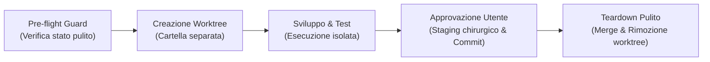
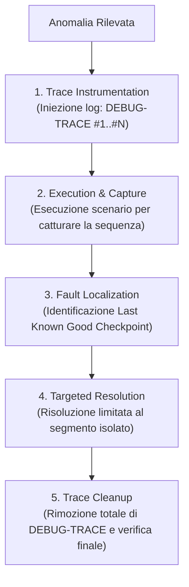

# Antigravity Plugin: Engineering Workflow & Trace Debugging

Plugin per Google Antigravity che impone standard professionali di **version control governance con Git**, **isolamento dei task multi-sessione** e **risoluzione scientifica dei difetti con breadcrumb trace**.

---

## Obiettivo del Plugin (Goal)

Nello sviluppo autonomo condotto da agenti AI emergono frequentemente tre rischi operativi:
1. **Inquinamento del version control**: l'uso indiscriminato di comandi massivi (`git add .`, `git add -A`) impegna file di dump, file di scratch o modifiche spurie, compromettendo la cronologia del repository.
2. **Collisioni tra sessioni concorrenti**: cambiare branch con `git checkout -b` direttamente nella cartella di lavoro principale modifica i file condivisi sul disco, corrompendo il lavoro di altre sessioni parallele o dell'utente.
3. **Debugging a tentativi (Shotgun Debugging)**: di fronte a un errore, l'agente tende a modificare righe casuali per congettura, introducendo nuovo debito tecnico anziché identificare la causa radice.

Il plugin `engineering-workflow` elimina questi rischi subordinando ogni operazione di Git a regole chirurgiche rigorose e imponendo la metodologia di **Deterministic Trace-Based Fault Localization**.

---

## Componenti del Plugin

| Componente | Tipo | Percorso | Funzione |
| :--- | :--- | :--- | :--- |
| **Regola di Condotta** | Regola attiva | [`rules/AGENTS.md`](./rules/AGENTS.md) | Vieta `git add .`, impone Conventional Commits in inglese, vieta commit/merge autonomi su `main` e prescrive l'isolamento del guasto basato su checkpoint. |
| **`worktree-lifecycle`** | Skill on-demand | [`skills/worktree-lifecycle/SKILL.md`](./skills/worktree-lifecycle/SKILL.md) | Guida completa a 5 fasi per creare rami di lavoro paralleli su cartelle separate, verificare le modifiche ed eseguire il teardown pulito. |
| **`trace-debugging`** | Skill on-demand | [`skills/trace-debugging/SKILL.md`](./skills/trace-debugging/SKILL.md) | Procedura di localizzazione guasti tramite iniezione log `[DEBUG-TRACE #X]`, rilevamento del Last Known Good Checkpoint e bonifica post-fix. |

---

## Standard di Version Control Governance

### 1. Staging Chirurgico Obbligatorio
- **Divieto categorico**: `git add .`, `git add -A`, `git commit -a`.
- I file devono essere aggiunti selettivamente specificando il percorso esatto:
  ```bash
  git add src/core/parser.js tests/parser.test.js
  ```
- Prima di qualsiasi operazione di staging o commit, verificare lo stato con `git status --porcelain` per escludere file temporanei.

### 2. Conventional Commits in Lingua Inglese
I messaggi di commit devono rispettare rigorosamente il formato standard:
- `feat(<scope>): concise description of new feature`
- `fix(<scope>): concise description of bug fix`
- `refactor(<scope>): internal architectural refactor without behavior changes`
- `test(<scope>): addition or update of automated test suites`
- `docs(<scope>): documentation, ADRs, or rule updates`
- `chore(<scope>): build, dependencies, or tooling adjustments`

### 3. Divieto di Commit o Merge Autonomo su `main`
L'agente non impegna né unisce modifiche sul branch principale senza l'esplicito benestare dell'utente. Il ciclo corretto prevede:
1. Sviluppo e verifica nel ramo/worktree isolato.
2. Presentazione del resoconto delle modifiche e delle istruzioni di collaudo.
3. Attesa della conferma positiva dell'utente.
4. Solo su richiesta esplicita: staging chirurgico, commit e merge.

---

## Metodologie Operative

### A. Isolamento con Git Worktrees (`worktree-lifecycle`)



Comando per isolare una lavorazione senza interferire con il repository principale:
```bash
git worktree add ../<repo>-<feature> -b feature/<feature>
```

---

### B. Deterministic Trace-Based Fault Localization (`trace-debugging`)

Quando un test fallisce o un comportamento diverge, è vietato tirare a indovinare:



Esempio di iniezione traccia:
```javascript
console.log('[DEBUG-TRACE #1] Ricezione payload evento', { payload });
console.log('[DEBUG-TRACE #2] Validazione precondizioni superata', { valid });
console.log('[DEBUG-TRACE #3] Risultato trasformazione pura', { result });
console.log('[DEBUG-TRACE #4] Persistenza su storage completata', { id });
```
La causa radice si trova necessariamente tra l'ultimo checkpoint che emette valori corretti e il primo checkpoint assente o inconsistente.

---

## Prompt di Esempio

- *"Inizializza un Git Worktree per sviluppare la nuova feature di autenticazione in modo isolato."*
- *"Applica il trace-debugging su questa funzione per localizzare il punto esatto in cui lo stato diverge."*
- *"Prepara lo staging chirurgico dei file modificati e formula il messaggio Conventional Commit per la mia approvazione."*

---

## Modalità di Installazione

### 1. Installazione nel Singolo Workspace (Consigliata)
```bash
# Linux/macOS
mkdir -p <percorso-progetto>/.agents/plugins
cp -r plugins/engineering-workflow <percorso-progetto>/.agents/plugins/

# Windows (PowerShell)
New-Item -ItemType Directory -Force -Path "<percorso-progetto>\.agents\plugins"
Copy-Item -Recurse plugins/engineering-workflow "<percorso-progetto>\.agents\plugins\"
```

Directory Junction su Windows:
```powershell
New-Item -ItemType Junction -Path "<percorso-progetto>\.agents\plugins\engineering-workflow" -Target "c:\github\antigravity-plugins\plugins\engineering-workflow"
```

### 2. Installazione Globale (Per tutti i progetti)
```powershell
Copy-Item -Recurse plugins/engineering-workflow "$env:USERPROFILE\.gemini\config\plugins\"
```

---

## Sinergia con gli Altri Plugin

- **`cognitive-persistence`**: i frammenti ADR in `.agents/worklog.d/` vengono redatti all'interno del worktree prima della rimozione del branch.
- **`execution-guard`**: collabora nel proteggere l'ambiente durante l'esecuzione dei test nel worktree, prevenendo comandi zombi e regressioni non rilevate.
