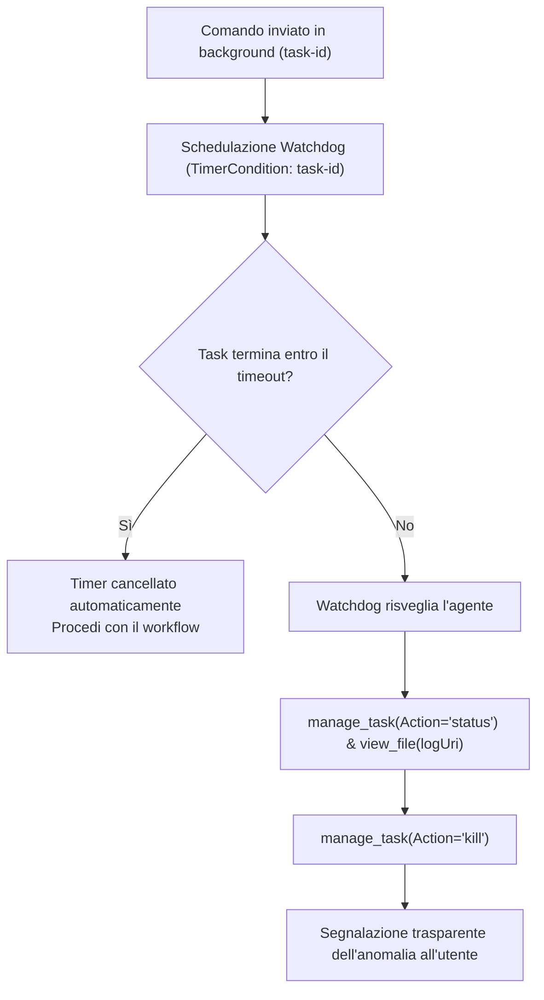

# Antigravity Plugin: Execution Guard & Anti-Freeze

Plugin per Google Antigravity progettato per garantire **resilienza operativa, prevenzione degli stalli in background e salvaguardia del budget di token** contro i loop agentici ricorsivi.

---

## Obiettivo del Plugin (Goal)

Durante sessioni di refactoring o esecuzione di test complessi, i workflow basati su agenti possono incorrere in fallimenti critici del ciclo di esecuzione:
1. **Congelamento della sessione (Anti-Freeze)**: un comando scivola in un task in background (`task-<id>`); l'agente cede il turno con una formula di attesa passiva (*"Sto attendendo il completamento..."*) senza impostare un timer. In assenza di eventi o se il processo si blocca, la sessione rimane congelata a tempo indefinito.
2. **Loop ricorsivi salva-token (Circuit Breaker)**: l'agente tenta ripetutamente di correggere un bug persistente proponendo lievi variazioni della stessa assunzione errata, consumando decine di migliaia di token a vuoto.
3. **Regression Cascading**: un fix parziale rompe altri test precedentemente funzionanti. L'agente stratifica ulteriori modifiche sullo stato regredito anziché annullare l'intervento fallimentare.
4. **Processi zombi**: script headless, server di test o child process non terminati continuano a girare in background consumando CPU e RAM.

Il plugin `execution-guard` implementa meccanismi formali di salvaguardia per rendere ogni esecuzione deterministica, monitorata e a prova di stallo.

---

## Componenti del Plugin

| Componente | Tipo | Percorso | Funzione |
| :--- | :--- | :--- | :--- |
| **Regola di Condotta** | Regola attiva | [`rules/AGENTS.md`](./rules/AGENTS.md) | Impone `WaitMsBeforeAsync: 10000`, watchdog obbligatorio su comandi asincroni con `schedule`, soglie quantitative del circuit breaker e timeout negli script. |
| **`task-watchdog`** | Skill on-demand | [`skills/task-watchdog/SKILL.md`](./skills/task-watchdog/SKILL.md) | Runbook operativo per rilevare task in stallo, ispezionarne i log tramite `manage_task` ed eseguirne la terminazione forzata (`kill`). |
| **`circuit-breaker`** | Skill on-demand | [`skills/circuit-breaker/SKILL.md`](./skills/circuit-breaker/SKILL.md) | Protocollo di blocco per errori invarianti, rollback automatico su regressioni ed escalation formale dell'architettura bloccata. |

---

## Meccanismi di Protezione Attiva

### 1. Watchdog Anti-Freeze su Task Asincroni
- **Priorità Sincrona**: Per comandi di test e build, l'agente imposta sempre `WaitMsBeforeAsync: 10000` per completare l'operazione in maniera sincrona.
- **Watchdog Reattivo**: Se il comando scivola comunque in background (`task-<id>`), l'agente **NON** cede passivamente il turno ma invoca nello stesso step il tool `schedule`:
  ```json
  {
    "DurationSeconds": 90,
    "TimerCondition": "<task-id>",
    "Prompt": "Watchdog: Il task <task-id> ha superato il tempo atteso (90s). Ispeziona lo stato con manage_task."
  }
  ```
  - Se il processo termina entro i 90s, Antigravity **cancella automaticamente** il timer.
  - Se il processo si blocca, allo scadere dei 90s il timer risveglia l'agente, che analizza i log con `manage_task(Action='status')` e termina il task con `manage_task(Action='kill')`.

### 2. Soglie Quantitative del Circuit Breaker

| Tipologia di Problema | Soglia Massima Tentativi | Azione Obbligatoria al Limite |
| :--- | :---: | :--- |
| **Errori di Build, Sintassi e Lint** | **3** | STOP immediato, dichiarazione stato STUCK, proposta rollback |
| **Test Unitari e Logica di Dominio** | **5** | STOP, root-cause analysis formale, richiesta guida all'utente |
| **Verifiche Visive / Headless Browser** | **3** | STOP, acquisizione screenshot, analisi ostacoli nel DOM |
| **Identico Errore (Stesso Messaggio/Riga)** | **2** | **INTERRUZIONE IMMEDIATA**: vietato tentare una terza volta |

### 3. Regression Rollback Guard
Se un intervento correttivo causa il fallimento di test che precedentemente passavano con esito positivo:
- L'agente esegue immediatamente il ripristino dei file (`git checkout -- <file>`).
- È tassativamente vietato stratificare correzioni sopra uno stato già regredito.

### 4. Timeout Rigido nei Processi Node.js
Ogni script standalone deve includere un watchdog a livello di runtime:

```javascript
const SCRIPT_TIMEOUT_MS = 45000;
const safetyWatchdog = setTimeout(() => {
  console.error(`[FATAL TIMEOUT] Script ha superato il timeout di ${SCRIPT_TIMEOUT_MS / 1000}s. Uscita forzata.`);
  process.exit(1);
}, SCRIPT_TIMEOUT_MS);
safetyWatchdog.unref(); // Consente l'uscita naturale se il processo termina prima
```

---

## Flusso di Diagnosi del Task Watchdog



---

## Prompt di Esempio

- *"Esegui la suite di test end-to-end con protezione watchdog per prevenire processi bloccati."*
- *"Se riscontri un errore di compilazione che si ripete due volte identico, attiva il circuit breaker e presenta le alternative."*
- *"Verifica la presenza di task orfani o processi in background e pulisci l'ambiente."*

---

## Modalità di Installazione

### 1. Installazione nel Singolo Workspace (Consigliata)
```bash
# Linux/macOS
mkdir -p <percorso-progetto>/.agents/plugins
cp -r plugins/execution-guard <percorso-progetto>/.agents/plugins/

# Windows (PowerShell)
New-Item -ItemType Directory -Force -Path "<percorso-progetto>\.agents\plugins"
Copy-Item -Recurse plugins/execution-guard "<percorso-progetto>\.agents\plugins\"
```

Directory Junction su Windows:
```powershell
New-Item -ItemType Junction -Path "<percorso-progetto>\.agents\plugins\execution-guard" -Target "c:\github\antigravity-plugins\plugins\execution-guard"
```

### 2. Installazione Globale (Per tutti i progetti)
```powershell
Copy-Item -Recurse plugins/execution-guard "$env:USERPROFILE\.gemini\config\plugins\"
```

---

## Sinergia con gli Altri Plugin

- **`engineering-workflow`**: protegge l'esecuzione dei comandi nei Git Worktree evitando stalli durante i test di integrazione.
- **`cognitive-persistence`**: le informazioni sul blocco e la causa radice isolata dopo lo scatto del circuit breaker vengono salvate in `MEMORY.md` come lezioni apprese.
