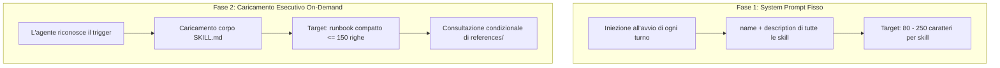
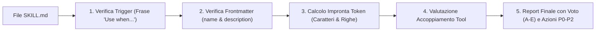

# Antigravity Plugin: Skill Governance & Token Optimization

Plugin per Google Antigravity progettato per garantire **la qualità ingegneristica, l'efficienza dei token e il controllo delle collisioni** nello sviluppo e nell'adozione di skill e plugin.

---

## Obiettivo del Plugin (Goal)

Nelle installazioni complesse di Antigravity, l'accumulo non regolamentato di skill personalizzate genera tre problemi architetturali:
1. **Saturazione del contesto globale (Token Bloat)**: Antigravity inietta i campi `name` e `description` di **tutte** le skill abilitate nel system prompt iniziale di ogni turno. Descrizioni verbose o prolisse consumano centinaia di token per ogni singolo messaggio, anche se la skill non viene mai invocata.
2. **Attivazioni spurie e trigger ambigui**: skill con trigger generici o privi di condizioni chiare (*"Use this skill when..."*) entrano in conflitto tra loro o vengono invocate dal modello in contesti non pertinenti.
3. **Collisioni e Shadowing silenzioso**: la presenza di skill con nomi identici o scopi sovrapposti distribuiti tra cartelle di workspace, plugin e configurazione globale genera comportamenti impredicibili dovuti alle priorità di risoluzione.

Il plugin `skill-governance` introduce standard di qualità formali, verifiche dimensionali (audit A-E) e procedure di rifattorizzazione basate sul principio della **divulgazione progressiva**.

---

## Componenti del Plugin

| Componente | Tipo | Percorso | Funzione |
| :--- | :--- | :--- | :--- |
| **Regola di Condotta** | Regola attiva | [`rules/AGENTS.md`](./rules/AGENTS.md) | Stabilisce i vincoli di scrittura per le skill: lunghezza description (80-250 caratteri), limite dimensionale per `SKILL.md` (≤ 150-200 righe) e trigger espliciti. |
| **`skill-audit`** | Skill on-demand | [`skills/skill-audit/SKILL.md`](./skills/skill-audit/SKILL.md) | Esegue un audit dimensionale su 5 assi (Trigger, Frontmatter, Taglia, Tool coupling, Verificabilità) con attribuzione di voto scolastico (A-E) e priorità (P0-P2). |
| **`skill-token-optimizer`** | Skill on-demand | [`skills/skill-token-optimizer/SKILL.md`](./skills/skill-token-optimizer/SKILL.md) | Guida passo-passo per snellire skill monolitiche: condensazione della description ed esternalizzazione di tabelle e guide in `references/` ed `examples/`. |
| **`skill-collision-check`** | Skill on-demand | [`skills/skill-collision-check/SKILL.md`](./skills/skill-collision-check/SKILL.md) | Mappa gerarchicamente le fonti di caricamento (workspace, plugin, global, builtin) per identificare casi di shadowing e duplicazione semantica. |
| **Specifiche Architetturali** | Riferimento | [`references/skill-governance-standards.md`](./references/skill-governance-standards.md) | Documento di specifica sul modello di caricamento a due fasi di Antigravity e metriche di benchmark. |
| **Esempio Before / After** | Esempio | [`examples/refactored-skill-example.md`](./examples/refactored-skill-example.md) | Caso studio pratico di rifattorizzazione di una skill complessa da monolitica a modulare. |

---

## Modello dei Token a Due Fasi

Per ottimizzare la spesa di token, Antigravity adotta una separazione a due stadi:



---

## Flusso della Skill `skill-audit`

La skill analizza qualsiasi `SKILL.md` secondo una checklist multidimensionale:



---

## Prompt di Esempio

- *"Esegui un audit completo di questa skill analizzando trigger, taglia e impronta di token."*
- *"Rifattorizza questa skill monolitica applicando la divulgazione progressiva e spostando la teoria in references/."*
- *"Verifica eventuali collisioni o shadowing tra le skill attive nel mio workspace e quelle globali."*

---

## Modalità di Installazione

### 1. Installazione nel Singolo Workspace (Consigliata)
```bash
# Linux/macOS
mkdir -p <percorso-progetto>/.agents/plugins
cp -r plugins/skill-governance <percorso-progetto>/.agents/plugins/

# Windows (PowerShell)
New-Item -ItemType Directory -Force -Path "<percorso-progetto>\.agents\plugins"
Copy-Item -Recurse plugins/skill-governance "<percorso-progetto>\.agents\plugins\"
```

Directory Junction su Windows:
```powershell
New-Item -ItemType Junction -Path "<percorso-progetto>\.agents\plugins\skill-governance" -Target "c:\github\antigravity-plugins\plugins\skill-governance"
```

### 2. Installazione Globale (Per tutti i progetti)
```powershell
Copy-Item -Recurse plugins/skill-governance "$env:USERPROFILE\.gemini\config\plugins\"
```

---

## Sinergia con gli Altri Plugin

- **`engineering-sobriety`**: collabora nel depurare le descrizioni delle skill da aggettivi promozionali, garantendo trigger asciutti e precisi.
- **`proactive-mentorship`**: utilizza le metriche di audit per consigliare all'utente il refactoring preventivo di skill obsolete o sovraccariche.
