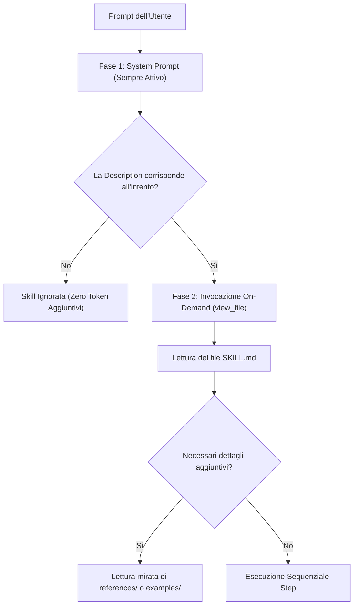

# Standard Architetturali per le Skill di Antigravity

Questa guida tecnica definisce le specifiche di progettazione per garantire efficienza di contesto, caricamento deterministico e compatibilità nell'ecosistema Antigravity.

---

## 1. Modello di Caricamento a Due Fasi

L'architettura di Antigravity gestisce le skill tramite caricamento progressivo:

### Conseguenze Architetturali:
1. **Ogni parola nella `description` ha un costo ricorrente**: Moltiplicata per ogni turno di ogni conversazione finché il plugin è attivo.
2. **Ogni riga in `SKILL.md` ha un costo contingente**: Consumata solo quando la procedura viene effettivamente attivata.
3. **I file in `references/` ed `examples/` hanno costo on-demand selettivo**: Letti solo se l'agente decide autonomamente di consultarli.

---

## 2. Checklist di Qualità e Benchmark Metrico

| Parametro | Valore Ottimale | Soglia di Allarme | Motivo Tecnico |
| :--- | :--- | :--- | :--- |
| **Lunghezza `name`** | 10–25 caratteri | $> 35$ caratteri | Rischio troncamento e verbosità. |
| **Formato `name`** | `kebab-case` minuscolo | Spazi, Maiuscole, Underscore | Scarto sintattico o incoerenza con convenzioni. |
| **Caratteri `description`** | 100–220 caratteri | $> 280$ caratteri | Inflazione ingiustificata del system prompt. |
| **Formulazione Trigger** | Clausola esplicita ("*Use this skill when...*") | Assente o generica | Attivazioni mancate o conflitti con altre skill. |
| **Righe in `SKILL.md`** | 80–160 righe | $> 250$ righe | Consumo eccessivo della finestra di contesto attiva. |
| **Rapporto Codice/Istruzioni** | Prevalenza di comandi deterministici | Spiegazioni narrative estese | Minore precisione esecutiva dell'agente. |
| **Expected Output** | Almeno 1 blocco di verifica per fase critica | Assente | Esecuzione cieca senza controllo errori. |

---

## 3. Gerarchia di Risoluzione delle Precedenze

Quando due skill condividono lo stesso identico `name`, Antigravity applica la seguente scala gerarchica:

$$\text{Workspace } (.agents/skills) > \text{Plugins del Progetto} > \text{Global Config } (~/.gemini/config) > \text{Built-in}$$

La risorsa a priorità inferiore subisce **shadowing completo e silente**: non riceverà alcun turno di esecuzione finché il conflitto non viene risolto tramite rinominazione o deprecazione.
