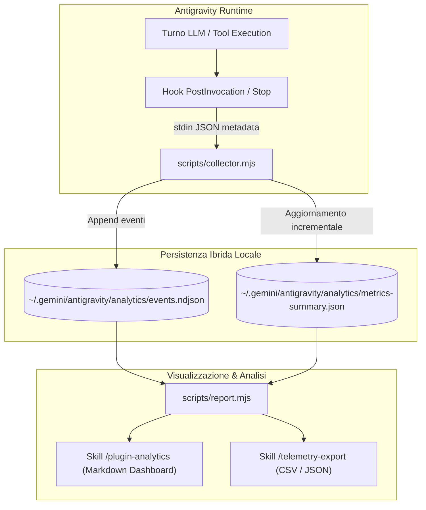

# Telemetry & Usage Analytics (`telemetry-analytics`)

Plugin di osservabilità e telemetria per Google Antigravity. Raccoglie in modo deterministico e a basso overhead metriche sull'utilizzo dei plugin, tempi di esecuzione dei turni, frequenza di attivazione delle skill, tassi di successo dei tool di sistema e consumo di token.

---

## 1. Obiettivo Primario

Nel runtime di Antigravity, i plugin modulari operano come componenti integrati senza un layer nativo di reporting quantitativo. Il plugin `telemetry-analytics` introduce un'infrastruttura di osservabilità trasparente:
- **Calcolo dei Tempi di Esecuzione**: Misura la latenza effettiva wall-clock di ciascun turno e sessione.
- **Riconoscimento di Plugin e Skill**: Identifica le skill attivate tramite pattern matching deterministico sui file `SKILL.md` letti dall'agente.
- **Affidabilità dei Tool**: Traccia il numero di invocazioni, i fallimenti ed il success rate di comandi e tool nativi (`run_command`, `replace_file_content`, `view_file`, ecc.).
- **Economia dei Token**: Registra input, output e cache-read ratio ad ogni turno.

---

## 2. Architettura Ibrida a Basso Overhead

Per evitare il freeze o l'overhead tipico degli hook sincroni per-tool su Windows (~150ms per tool call), il plugin adotta un modello batch asincrono:



### Perché l'Approccio Ibrido?
1. **Zero Impatto sul Turno Utente**: L'hook `PostInvocation` viene eseguito una sola volta per turno, analizzando gli step incrementali dal log `transcript.jsonl`.
2. **Archiviazione Cross-Project**: I dati risiedono centralmente in `~/.gemini/antigravity/analytics/`, ma ogni evento include il tag del percorso workspace, consentendo sia report isolati per singolo progetto sia statistiche complessive.
3. **Resilienza e Timeout**: Gli script integrano watchdog rigidi di sicurezza (`WATCHDOG_TIMEOUT_MS`) per garantire che l'agente non resti mai bloccato.

---

## 3. Struttura del Plugin

```
plugins/telemetry-analytics/
├── plugin.json                    # Manifest del plugin (SemVer 1.0.0, 3 prompt)
├── README.md                      # Questa documentazione tecnica
├── hooks.json                     # Hook PostInvocation e Stop
├── scripts/
│   ├── collector.mjs              # Ingestore batch incrementale da transcript.jsonl
│   └── report.mjs                 # Motore di aggregazione e reporting CLI
├── rules/
│   └── AGENTS.md                  # Regole di sobrietà metrica e riservatezza locale
└── skills/
    ├── plugin-analytics/
    │   └── SKILL.md               # Skill per consultare le metriche (/plugin-analytics)
    └── telemetry-export/
        └── SKILL.md               # Skill per esportare dati grezzi CSV/JSON (/telemetry-export)
```

---

## 4. Modalità di Consultazione

### Interfaccia Chat & Slash Commands
- `/plugin-analytics`: Mostra il riepilogo tabellare del workspace corrente.
- `Mostra le statistiche globali dei plugin`: Visualizza le metriche aggregate di tutti i progetti.
- `/telemetry-export`: Guida all'esportazione dei log in CSV o JSON.

### Comandi CLI Diretti
```bash
# Report del workspace corrente
node plugins/telemetry-analytics/scripts/report.mjs

# Report globale aggregato
node plugins/telemetry-analytics/scripts/report.mjs --global

# Output JSON per automazioni
node plugins/telemetry-analytics/scripts/report.mjs --json

# Esportazione CSV
node plugins/telemetry-analytics/scripts/report.mjs --csv > export.csv

# Reset dei dati
node plugins/telemetry-analytics/scripts/report.mjs --reset
```

---

## 5. Schema Dati

### Evento Grezzo (`events.ndjson`)
```json
{
  "ts": "2026-10-07T20:30:15.120Z",
  "conversationId": "ffe44021-1308-4301-8d6b-4cef8997c0c8",
  "workspace": "c:/github/antigravity-plugins",
  "workspaceName": "antigravity-plugins",
  "durationMs": 4200,
  "tokens": { "input": 15000, "output": 400, "cacheRead": 25000 },
  "plugins": {
    "cognitive-persistence": { "invocations": 1, "skills": { "memory-sync": 1 } }
  },
  "tools": {
    "view_file": { "calls": 3, "errors": 0 },
    "run_command": { "calls": 1, "errors": 0 }
  },
  "stepCount": 8
}
```
